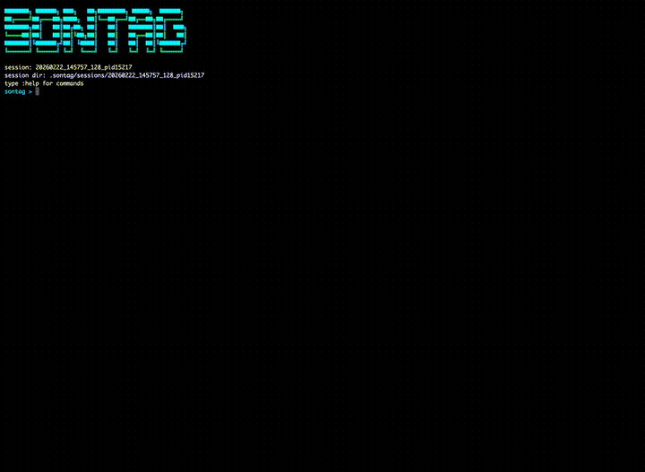

```text
███████╗ ██████╗ ███╗   ██╗████████╗ █████╗  ██████╗
██╔════╝██╔═══██╗████╗  ██║╚══██╔══╝██╔══██╗██╔════╝
███████╗██║   ██║██╔██╗ ██║   ██║   ███████║██║  ███╗
╚════██║██║   ██║██║╚██╗██║   ██║   ██╔══██║██║   ██║
███████║╚██████╔╝██║ ╚████║   ██║   ██║  ██║╚██████╔╝
╚══════╝ ╚═════╝ ╚═╝  ╚═══╝   ╚═╝   ╚═╝  ╚═╝ ╚═════╝
```

get real content out of your code. sontag is a C++ interpreter, assembly explorer, and analysis-focused code execution harness

## command paradigm

sontag commands are organized by output mode:

- `static`: base command, deterministic text output
  - examples: `:asm`, `:ir`, `:graph cfg`, `:graph call`
- `explore`: interactive TTY mode (arrows, `j/k`, enter/quit depending on command)
  - examples: `:asm explore`, `:ir explore`, `:mem_explore`
- `inspect`: structured JSON export for downstream tooling
  - examples: `:inspect asm`, `:inspect mem`, `:inspect mca summary`, `:inspect mca heatmap`

## requirements

- linux or macOS
- cmake
- ninja
- llvm/clang toolchain (clang >= 20), including:
  - `clang++`
  - `llvm-mca`
  - `llvm-objdump`
  - `llvm-nm`

macOS:

- install LLVM from Homebrew:
  - `brew install llvm@21`

## build

### linux

```bash
mkdir -p build
cd build
cmake .. -G Ninja \
  -DCMAKE_C_COMPILER=clang \
  -DCMAKE_CXX_COMPILER=clang++
ninja -v
```

### macOS

`CMakeLists.txt` auto-detects Homebrew LLVM by default.

```bash
mkdir -p build
cd build
cmake .. -G Ninja
ninja -v
```

optional toolchain bin override:

```bash
cmake .. -G Ninja -DSONTAG_TOOLCHAIN_BIN_DIR=/custom/llvm/bin
```

### run

```bash
./build/sontag
```

### tests

```bash
./build/tests/alltests
```

## quickstart

```text
:decl int value = 64;
:decl int values[4];
values[0] = value;
values[1] = value * 2;
values[2] = values[0] + values[1];
:show all
:symbols
:asm
:ir
:ir explore
```

## explore mode

note: the following examples use the same common code file loaded by `:file`
```cpp
int value = 64;
int values[4];

constexpr int add(int a, int b) {
    return a + b;
}

constexpr int fold(int a, int b, int c) {
    if (--c > 0) {
        return fold(a, add(a, b), c);
    }
    return add(a, b);
}

int main() {
    auto double_value = value * 2;
    values[0] = value;
    values[1] = double_value;
    values[2] = add(values[0], values[1]);
    values[3] = fold(values[0], values[1], 3);

    return 0;
}
```

### `:asm explore`

interactive assembly view with:

- opcode summary
- per-instruction rows (offset, encodings, instruction text, definitions)
- selected instruction metadata
- optional enter-on-call traversal into callee symbol

controls:

- `up`/`sown` or `j`/`k`: move selection
- `enter`: follow callable symbol on selected row (when available)
- `q`: exit (recursively if you have followed callable symbols)


### `:ir explore`

interactive IR view with:

- full node table (`id`, `out`, `in`, `label`)
- Sugiyama layout below the table
- selected/incoming/outgoing node id coloring in the layout

controls:

- `up`/`down` or `j`/`k`: move selection
- `q`: exit


### `:mem explore`

interactive memory access view with instrumented runtime tracing (WIP). rows show access kind, width, address, symbol, alias group, and observed values from execution. detail pane includes address decomposition, effective address, and traced before→after values for rmw.

- `:mem [symbol|@last]`: traced memory table
- `:mem explore [symbol|@last]`: interactive row navigation
- `:inspect mem [symbol|@last]`: structured JSON output

controls:

- `up`/`down` or `j`/`k`: move selection
- `enter`: follow callable symbol on selected row (when available)
- `q`: exit


### arm64 instruction support
currently tested on:
- apple silicon M4 (welcoming any feedback on x86 Intel Mac performance, as I don't own one)
- aarch64 Raspberry Pi



## state and session commands

- `:decl <code>`: append declarative cell
- `:declfile <path>`: import full file as one declarative cell
- `:file <path>`: import file as decl + exec split from `main`
- `:openfile <path>`: open editor, run repo `.clang-format`, import with `:file` semantics
- bare input (non-command): append executable cell
- `:show <config|decl|exec|all>`: inspect current state
- `:symbols`: list discovered symbols from current snapshot
- `:clear`: clear terminal screen
- `:help`: print command help
- `:quit`: exit REPL

## reset and snapshot semantics

- snapshots persist across normal `:reset`
- `:mark <name>`: create/update snapshot tag
- `:snapshots`: list named snapshots
- `:reset`: clear active state (cells + transactions), keep snapshots
- `:reset last`: undo last successful mutation transaction
- `:reset file <path>`: undo most recent import transaction for that normalized path
- `:reset snapshots`: clear snapshot store

## config semantics

` :config` is category-driven:

- `:config`: interactive category menu (`build`, `ui`, `session`, `editor`)
- `:config <category>`: print keys/values for one category
- `:config <key>=<value>`: set one key
- `:config reset`: restore mutable keys to defaults

## static analysis commands

### `:asm [symbol|@last]`

- default symbol: `main` (equivalent to `main`)
- prints operation summary, opcode counts, and normalized assembly rows

### `:ir [symbol|@last]`

- default symbol: `main`
- prints IR node table plus Sugiyama layout keyed by `n*` ids

### `:diag [symbol|@last]`

- compile diagnostics for current snapshot/symbol

### `:mca [symbol|@last]`

- runs `llvm-mca` and prints throughput/latency/resource data
- data symbols are invalid targets
- macOS arm64 note: `.subsections_via_symbols` is stripped before invoking `llvm-mca` for stable compatibility ([bugfix](https://github.com/llvm/llvm-project/pull/182694))

### `:delta`

modes:

- `:delta [target_opt] [symbol|@last]`: pairwise (`O0 -> target_opt`, default target `O2`)
- `:delta spectrum [target_opt] [symbol|@last]`: multi-level (`O0..target_opt`)
- `:delta <snapshot> [target_opt]`: current-vs-snapshot comparison

snapshot mode defaults to implicit symbol scope:

- `:delta <snapshot>` == `:delta <snapshot> main`

n-way snapshot compare:

- `:delta <snapshot1>,<snapshot2>,<snapshot3>`
  - compares `current` against each listed snapshot in one command

### `:graph`

supported graph subcommands:

- `:graph cfg [symbol|@last]`
- `:graph cfg export [symbol|@last]`
- `:graph call [symbol|@last]`
- `:graph call export [symbol|@last]`

behavior:

- `:graph cfg` / `:graph call` render terminal Sugiyama graph and append `dot:` / `rendered:` artifact paths
- `:graph cfg export` / `:graph call export` print artifact summary and emit DOT (+ rendered image if available)

### `:inspect`

structured JSON payload exporters:

- `:inspect asm [symbol|@last]`
- `:inspect mca [summary|heatmap] [symbol|@last]`

artifacts are written under `artifacts/inspect/...`.

## mcp server support

sontag can run as an [MCP](https://modelcontextprotocol.io/) server, exposing its analysis capabilities to LLMs and agentic tools over JSON-RPC via stdio.

build with MCP support:

```bash
cmake .. -G Ninja -DSONTAG_MCP=ON
```

run:

```bash
sontag --mcp
```

### configuration

for [claude code](https://docs.anthropic.com/en/docs/claude-code/mcp), add to `~/.claude/settings.json`:

```json
{
  "mcpServers": {
    "sontag": {
      "command": "/path/to/sontag",
      "args": ["--mcp", "--std", "c++20"]
    }
  }
}
```

for [codex cli](https://developers.openai.com/codex/mcp/), add to `~/.codex/config.toml` or `.codex/config.toml`:

```toml
[mcp_servers.sontag]
command = "/path/to/sontag"
args = ["--mcp", "--std", "c++23"]
```

any CLI flags passed alongside `--mcp` become defaults for all tool invocations (`--std`, `--opt`, `--target`, `--cpu`, `--mca`, etc.).

### tools

two tools are exposed:

- `eval`: stateless, single-shot analysis. spawns an isolated subprocess per call — no state persists between invocations.
- `session_eval`: stateful, persistent session. commands are sent to a long-lived REPL child process. state (cells, snapshots, config) accumulates across calls.

### `eval`

pass file paths and a REPL command. the MCP server spawns `sontag --file ... --eval ...` as a subprocess and returns captured output.

```json
{
  "name": "eval",
  "arguments": {
    "declfiles": ["containers.hpp", "math_utils.hpp"],
    "files": ["matrix_multiply.cpp"],
    "command": ":delta spectrum O3",
    "opt_level": "O0",
    "standard": "c++23",
    "target": "x86_64-unknown-linux-gnu",
    "cpu": "znver4"
  }
}
```

### `session_eval`

send any REPL command or single-line expression to the persistent session. the full command set is available (`:file`, `:declfile`, `:asm`, `:inspect`, `:mark`, `:delta`, `:config`, etc.).

```json
{ "name": "session_eval", "arguments": { "input": ":declfile simd_types.hpp" } }
{ "name": "session_eval", "arguments": { "input": ":file sort_benchmark.cpp" } }
{ "name": "session_eval", "arguments": { "input": ":config opt=O2" } }
{ "name": "session_eval", "arguments": { "input": ":mark v1_scalar" } }
{ "name": "session_eval", "arguments": { "input": ":file sort_benchmark_v2.cpp" } }
{ "name": "session_eval", "arguments": { "input": ":delta v1_scalar" } }
{ "name": "session_eval", "arguments": { "input": ":inspect mca heatmap sort" } }
{ "name": "session_eval", "arguments": { "input": ":graph cfg sort" } }
```

### multi-instance

each `sontag --mcp` process gets an independent session directory (`.sontag/mcp-1/`, `.sontag/mcp-2/`, ...). orphaned instances from dead processes are cleaned up on startup.

### crash recovery

if the persistent child crashes, the next `session_eval` returns an error and automatically respawns a fresh child. the MCP server stays alive — no client-side restart needed.

## full command list

```text
:help
:clear
:show <config|decl|exec|all>
:symbols
:decl <code>
:declfile <path>
:file <path>
:openfile <path>
:config
:config <category>
:config <key>=<value>
:config reset
:reset
:reset last
:reset snapshots
:reset file <path>
:mark <name>
:snapshots
:asm [symbol|@last]
:asm explore [symbol|@last]
:ir [symbol|@last]
:ir explore [symbol|@last]
:mem [symbol|@last]
:mem explore [symbol|@last]
:inspect mem [symbol|@last]
:diag [symbol|@last]
:mca [symbol|@last]
:delta [spectrum] [target_opt] [symbol|@last]
:delta <snapshot> [target_opt]
:inspect asm [symbol|@last]
:inspect mca [summary|heatmap] [symbol|@last]
:graph cfg [symbol|@last]
:graph cfg export [symbol|@last]
:graph call [symbol|@last]
:graph call export [symbol|@last]
:quit
```

## notes

- `color_scheme` currently supports `classic` and `vaporwave` (default).
- default `build.opt` is `O0`.
- generated source ensures synthesis of a single trailing `return` in `main`.
